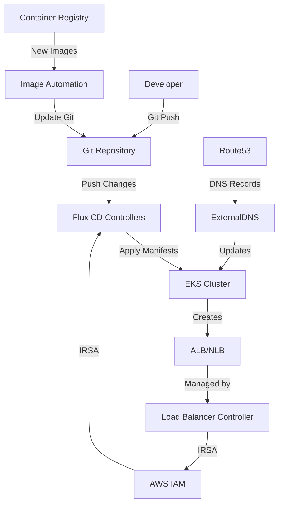

# EKS Cluster with Flux CD GitOps

This example demonstrates how to deploy a **production-ready EKS cluster** with Flux CD enabled for complete GitOps continuous deployment, including all necessary DNS and load balancing components.

## 🎯 What This Example Provides

- **EKS Cluster**: Production-ready Kubernetes cluster on AWS with all add-ons
- **Flux CD**: Complete GitOps continuous delivery tool for automated deployments
- **AWS Load Balancer Controller**: Automatic ALB/NLB creation with IRSA integration
- **ExternalDNS**: Automatic DNS record management for ingresses and services
- **IRSA Integration**: IAM Roles for Service Accounts for secure AWS access
- **Image Automation**: Automatic container image updates from registries
- **Git Repository Sync**: Continuous monitoring of Git repositories for changes
- **Complete DNS Stack**: Route53 integration with external-dns automation

## 🏗️ Architecture Overview



## 📋 Prerequisites

### Required Tools
- [Terraform](https://www.terraform.io/downloads.html) >= 1.0
- [AWS CLI](https://aws.amazon.com/cli/) configured with appropriate permissions
- [kubectl](https://kubernetes.io/docs/tasks/tools/) for cluster interaction
- [Flux CLI](https://fluxcd.io/flux/installation/) (recommended for management)

### AWS Permissions
Your AWS credentials need permissions for:
- EKS cluster management
- EC2 (VPC, subnets, security groups)
- IAM (roles, policies, OIDC provider)
- Route53 (if using DNS automation)
- ECR (if using AWS container registry)

### Git Repository Setup
1. Create a Git repository for your Kubernetes manifests
2. Structure it according to GitOps best practices (see below)
3. Configure authentication if using a private repository

## 🚀 Quick Start

### 1. Clone and Configure

```bash
git clone <this-repository>
cd examples/flux-cd
```

### 2. Update Configuration

Edit `terraform.tfvars` with your specific values:

```hcl
# Basic cluster configuration
cluster_name = "my-flux-cd-cluster"
cluster_version = "1.32"

# Network configuration
vpc_name = "my-vpc"  # or use vpc_id for explicit VPC
public_access_cidrs = ["YOUR.IP.ADDRESS/32"]  # Replace with your IP!

# DNS Configuration (optional but recommended)
create_hosted_zones = true
hosted_zone_domains = ["example.com"]

# Flux CD configuration
enable_flux_cd = true
flux_cd_git_repository_url = "https://github.com/your-org/k8s-manifests"
flux_cd_git_repository_branch = "main"
flux_cd_git_repository_path = "./clusters/my-flux-cd-cluster"
flux_cd_image_automation = true

# IMPORTANT: Enable Helm deployments for full functionality
enable_helm_deployments = true

# For private repositories:
# flux_cd_git_auth_secret_name = "flux-git-auth"
```

### 3. Deploy Infrastructure

```bash
terraform init
terraform plan
terraform apply
```

### 4. Configure kubectl

```bash
# Get the kubeconfig command from Terraform output
terraform output kubeconfig_command

# Run the command (example):
aws eks update-kubeconfig --region us-west-2 --name my-flux-cd-cluster
```

### 5. Verify Installation

```bash
# Check cluster nodes
kubectl get nodes

# Check all components are running
kubectl get pods -n kube-system

# Check Flux CD installation
kubectl get pods -n flux-system

# Verify Load Balancer Controller
kubectl get deployment -n kube-system aws-load-balancer-controller

# Verify ExternalDNS
kubectl get deployment -n kube-system external-dns

# Check Flux CD resources
flux get sources git
flux get kustomizations
```

### 6. Follow Setup Instructions

```bash
# Get detailed setup instructions
terraform output flux_cd_setup_instructions
```

## 📁 Recommended Git Repository Structure

Organize your Kubernetes manifests repository like this:

```
k8s-manifests/
├── clusters/                          # Cluster-specific configurations
│   ├── my-flux-cd-cluster/
│   │   ├── flux-system/               # Flux CD bootstrap files
│   │   │   ├── gotk-components.yaml
│   │   │   ├── gotk-sync.yaml
│   │   │   └── kustomization.yaml
│   │   ├── infrastructure.yaml        # Infrastructure components
│   │   └── apps.yaml                  # Application deployments
│   └── staging-cluster/
│       └── ...
├── infrastructure/                     # Shared infrastructure components
│   ├── controllers/
│   │   ├── ingress-nginx/
│   │   ├── cert-manager/
│   │   └── prometheus/
│   └── configs/
│       ├── monitoring/
│       └── logging/
└── apps/                              # Application manifests
    ├── base/                          # Base configurations
    │   ├── webapp/
    │   │   ├── deployment.yaml
    │   │   ├── service.yaml
    │   │   └── kustomization.yaml
    │   └── api/
    └── overlays/                      # Environment-specific overlays
        ├── development/
        ├── staging/
        └── production/
```

## 🔐 Private Repository Authentication

For private Git repositories, create authentication secrets:

### SSH Key Authentication

```bash
# Generate SSH key for Flux CD
ssh-keygen -t ed25519 -C "flux-cd@your-domain.com" -f ~/.ssh/flux_rsa -N ""

# Add public key to your Git repository's deploy keys
cat ~/.ssh/flux_rsa.pub

# Create Kubernetes secret
kubectl create secret generic flux-git-auth \
  --from-file=identity=~/.ssh/flux_rsa \
  --from-file=known_hosts=<(ssh-keyscan github.com) \
  -n flux-system

# Update terraform.tfvars
flux_cd_git_auth_secret_name = "flux-git-auth"
flux_cd_git_repository_url = "git@github.com:your-org/k8s-manifests.git"
```

### Token Authentication

```bash
# Create personal access token in your Git provider
# Create Kubernetes secret
kubectl create secret generic flux-git-auth \
  --from-literal=username=git \
  --from-literal=password=YOUR_TOKEN \
  -n flux-system
```

## 🛠️ Management Commands

### Flux CLI Commands

```bash
# Install Flux CLI
curl -s https://fluxcd.io/install.sh | sudo bash

# Check Flux status
flux check

# Get all sources
flux get sources git

# Get all kustomizations
flux get kustomizations

# Force reconciliation
flux reconcile source git flux-system
flux reconcile kustomization flux-system

# Suspend/resume
flux suspend kustomization flux-system
flux resume kustomization flux-system

# Check image automation
flux get images repository
flux get images policy
flux get images update
```

### Kubectl Commands

```bash
# Check Flux CD pods
kubectl get pods -n flux-system

# Check AWS Load Balancer Controller
kubectl get pods -n kube-system -l app.kubernetes.io/name=aws-load-balancer-controller

# Check ExternalDNS
kubectl get pods -n kube-system -l app.kubernetes.io/name=external-dns

# Check custom resources
kubectl get gitrepositories -n flux-system
kubectl get kustomizations -n flux-system
kubectl get imagerepositories -n flux-system
kubectl get imagepolicies -n flux-system

# Check logs
kubectl logs -n flux-system -l app=source-controller
kubectl logs -n flux-system -l app=kustomize-controller
kubectl logs -n flux-system -l app=image-reflector-controller
kubectl logs -n flux-system -l app=image-automation-controller

# Check Load Balancer Controller logs
kubectl logs -n kube-system -l app.kubernetes.io/name=aws-load-balancer-controller

# Check ExternalDNS logs
kubectl logs -n kube-system -l app.kubernetes.io/name=external-dns
```

## 🔍 Troubleshooting

### Common Issues

1. **Git Authentication Failures**
   ```bash
   # Check secret
   kubectl get secret flux-git-auth -n flux-system -o yaml
   
   # Verify SSH connection
   ssh -T git@github.com -i ~/.ssh/flux_rsa
   ```

2. **Load Balancer Controller Issues**
   ```bash
   # Check IRSA configuration
   kubectl describe sa aws-load-balancer-controller -n kube-system
   
   # Check controller logs
   kubectl logs -n kube-system -l app.kubernetes.io/name=aws-load-balancer-controller
   ```

3. **ExternalDNS Issues**
   ```bash
   # Check IRSA configuration
   kubectl describe sa external-dns -n kube-system
   
   # Check DNS logs
   kubectl logs -n kube-system -l app.kubernetes.io/name=external-dns
   ```

## 🧹 Cleanup

To destroy the infrastructure:

```bash
terraform destroy
```

**Note**: This will permanently delete your EKS cluster and all associated resources.

## 📚 Additional Resources

- [Flux CD Documentation](https://fluxcd.io/docs/)
- [AWS EKS Best Practices](https://aws.github.io/aws-eks-best-practices/)
- [AWS Load Balancer Controller](https://kubernetes-sigs.github.io/aws-load-balancer-controller/)
- [ExternalDNS Documentation](https://github.com/kubernetes-sigs/external-dns)
- [GitOps Principles](https://www.gitops.tech/)