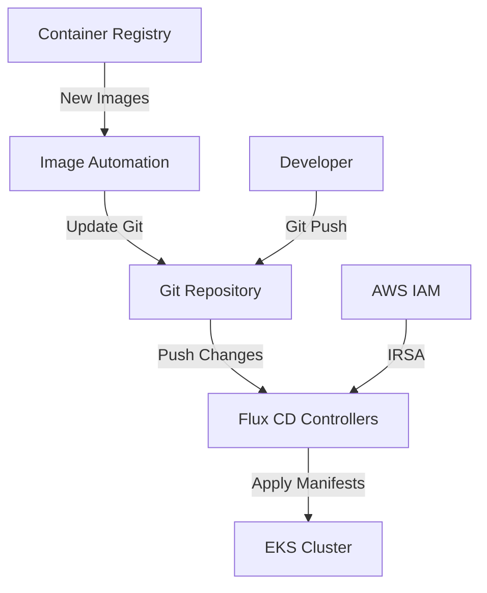

# EKS Cluster with Flux CD GitOps

This example demonstrates how to deploy an EKS cluster with Flux CD enabled for GitOps continuous deployment.

## 🎯 What This Example Provides

- **EKS Cluster**: Production-ready Kubernetes cluster on AWS
- **Flux CD**: GitOps continuous delivery tool for automated deployments
- **IRSA Integration**: IAM Roles for Service Accounts for secure AWS access
- **Image Automation**: Automatic image updates from container registries
- **Git Repository Sync**: Continuous monitoring of Git repositories for changes

## 🏗️ Architecture Overview



## 📋 Prerequisites

### Required Tools
- [Terraform](https://www.terraform.io/downloads.html) >= 1.0
- [AWS CLI](https://aws.amazon.com/cli/) configured with appropriate permissions
- [kubectl](https://kubernetes.io/docs/tasks/tools/) for cluster interaction
- [Flux CLI](https://fluxcd.io/flux/installation/) (recommended for management)

### AWS Permissions
Your AWS credentials need permissions for:
- EKS cluster management
- EC2 (VPC, subnets, security groups)
- IAM (roles, policies, OIDC provider)
- ECR (if using AWS container registry)

### Git Repository Setup
1. Create a Git repository for your Kubernetes manifests
2. Structure it according to GitOps best practices (see below)
3. Configure authentication if using a private repository

## 🚀 Quick Start

### 1. Clone and Configure

```bash
git clone <this-repository>
cd examples/flux-cd
cp terraform.tfvars.example terraform.tfvars
```

### 2. Update Configuration

Edit `terraform.tfvars` with your specific values:

```hcl
# Basic cluster configuration
cluster_name = "my-flux-cd-cluster"
cluster_version = "1.32"

# Network configuration
vpc_name = "my-vpc"  # or use vpc_id for explicit VPC
public_access_cidrs = ["YOUR.IP.ADDRESS/32"]  # Replace with your IP!

# Flux CD configuration
enable_flux_cd = true
flux_cd_git_repository_url = "https://github.com/your-org/k8s-manifests"
flux_cd_git_repository_branch = "main"
flux_cd_git_repository_path = "./clusters/my-flux-cd-cluster"
flux_cd_image_automation = true

# For private repositories:
# flux_cd_git_auth_secret_name = "flux-git-auth"
```

### 3. Deploy Infrastructure

```bash
terraform init
terraform plan
terraform apply
```

### 4. Configure kubectl

```bash
# Get the kubeconfig command from Terraform output
terraform output kubeconfig_command

# Run the command (example):
aws eks update-kubeconfig --region us-west-2 --name my-flux-cd-cluster
```

### 5. Verify Installation

```bash
# Check cluster nodes
kubectl get nodes

# Check Flux CD installation
kubectl get pods -n flux-system

# Check Flux CD resources
flux get sources git
flux get kustomizations
```

### 6. Follow Setup Instructions

```bash
# Get detailed setup instructions
terraform output flux_cd_setup_instructions
```

## 📁 Recommended Git Repository Structure

Organize your Kubernetes manifests repository like this:

```
k8s-manifests/
├── clusters/                          # Cluster-specific configurations
│   ├── my-flux-cd-cluster/
│   │   ├── flux-system/               # Flux CD bootstrap files
│   │   │   ├── gotk-components.yaml
│   │   │   ├── gotk-sync.yaml
│   │   │   └── kustomization.yaml
│   │   ├── infrastructure.yaml        # Infrastructure components
│   │   └── apps.yaml                  # Application deployments
│   └── staging-cluster/
│       └── ...
├── infrastructure/                     # Shared infrastructure components
│   ├── controllers/
│   │   ├── ingress-nginx/
│   │   ├── cert-manager/
│   │   └── prometheus/
│   └── configs/
│       ├── monitoring/
│       └── logging/
└── apps/                              # Application manifests
    ├── base/                          # Base configurations
    │   ├── webapp/
    │   │   ├── deployment.yaml
    │   │   ├── service.yaml
    │   │   └── kustomization.yaml
    │   └── api/
    └── overlays/                      # Environment-specific overlays
        ├── development/
        ├── staging/
        └── production/
```

## 🔐 Private Repository Authentication

If using a private Git repository, create authentication secrets:

### SSH Key Authentication

```bash
# Create SSH key pair
ssh-keygen -t rsa -b 4096 -f ~/.ssh/flux_rsa

# Add public key to your Git provider
cat ~/.ssh/flux_rsa.pub

# Create Kubernetes secret
kubectl create secret generic flux-git-auth \
  --from-file=identity=~/.ssh/flux_rsa \
  --from-literal=known_hosts="$(ssh-keyscan github.com)" \
  -n flux-system
```

### Token Authentication

```bash
# Create secret with token
kubectl create secret generic flux-git-auth \
  --from-literal=username=your-username \
  --from-literal=password=your-token \
  -n flux-system
```

## 🖼️ Image Automation Setup

Enable automatic image updates by adding these resources to your Git repository:

### ImageRepository

```yaml
apiVersion: image.toolkit.fluxcd.io/v1beta2
kind: ImageRepository
metadata:
  name: webapp
  namespace: flux-system
spec:
  image: your-account.dkr.ecr.us-west-2.amazonaws.com/webapp
  interval: 1m
  secretRef:
    name: ecr-credentials  # If using private ECR
```

### ImagePolicy

```yaml
apiVersion: image.toolkit.fluxcd.io/v1beta2
kind: ImagePolicy
metadata:
  name: webapp-policy
  namespace: flux-system
spec:
  imageRepositoryRef:
    name: webapp
  policy:
    semver:
      range: '>=1.0.0'
```

### ImageUpdateAutomation

```yaml
apiVersion: image.toolkit.fluxcd.io/v1beta1
kind: ImageUpdateAutomation
metadata:
  name: webapp-automation
  namespace: flux-system
spec:
  interval: 1m
  sourceRef:
    kind: GitRepository
    name: flux-system
  git:
    checkout:
      ref:
        branch: main
    commit:
      author:
        email: flux@example.com
        name: Flux
      messageTemplate: |
        Automated image update
        
        Automation name: {{ .AutomationObject }}
        
        Files:
        {{ range $filename, $_ := .Updated.Files -}}
        - {{ $filename }}
        {{ end -}}
        
        Objects:
        {{ range $resource, $_ := .Updated.Objects -}}
        - {{ $resource.Kind }} {{ $resource.Name }}
        {{ end -}}
    push:
      branch: main
  update:
    path: "./clusters/my-flux-cd-cluster"
    strategy: Setters
```

### Application Deployment with Image Automation

```yaml
apiVersion: apps/v1
kind: Deployment
metadata:
  name: webapp
spec:
  template:
    spec:
      containers:
      - name: webapp
        image: your-account.dkr.ecr.us-west-2.amazonaws.com/webapp:1.0.0 # {"$imagepolicy": "flux-system:webapp-policy"}
```

## 🛠️ Management Commands

### Flux CLI Commands

```bash
# Install Flux CLI
curl -s https://fluxcd.io/install.sh | sudo bash

# Check Flux status
flux check

# Get all sources
flux get sources git

# Get all kustomizations
flux get kustomizations

# Force reconciliation
flux reconcile source git flux-system
flux reconcile kustomization flux-system

# Suspend/resume
flux suspend kustomization flux-system
flux resume kustomization flux-system

# Check image automation
flux get images repository
flux get images policy
flux get images update
```

### Kubectl Commands

```bash
# Check Flux CD pods
kubectl get pods -n flux-system

# Check custom resources
kubectl get gitrepositories -n flux-system
kubectl get kustomizations -n flux-system
kubectl get imagerepositories -n flux-system
kubectl get imagepolicies -n flux-system

# Check logs
kubectl logs -n flux-system -l app=source-controller
kubectl logs -n flux-system -l app=kustomize-controller
kubectl logs -n flux-system -l app=image-reflector-controller
kubectl logs -n flux-system -l app=image-automation-controller

# Describe resources for troubleshooting
kubectl describe gitrepository flux-system -n flux-system
kubectl describe kustomization flux-system -n flux-system
```

## 🔍 Troubleshooting

### Common Issues

1. **Git Authentication Failures**
   ```bash
   # Check secret
   kubectl get secret flux-git-auth -n flux-system -o yaml
   
   # Verify SSH connection
   ssh -T git@github.com -i ~/.ssh/flux_rsa
   ```

2. **Image Pull Failures**
   ```bash
   # Check ECR authentication
   aws ecr get-login-password --region us-west-2 | docker login --username AWS --password-stdin <account>.dkr.ecr.us-west-2.amazonaws.com
   
   # Create ECR secret if needed
   kubectl create secret docker-registry ecr-credentials \
     --docker-server=<account>.dkr.ecr.us-west-2.amazonaws.com \
     --docker-username=AWS \
     --docker-password=$(aws ecr get-login-password --region us-west-2) \
     -n flux-system
   ```

3. **Reconciliation Issues**
   ```bash
   # Check Flux CD status
   flux check
   
   # Force reconciliation
   flux reconcile source git flux-system --verbose
   ```

### Useful Debugging

```bash
# Get all Flux CD events
kubectl get events -n flux-system --sort-by='.lastTimestamp'

# Check resource status
kubectl get gitrepository flux-system -n flux-system -o yaml
kubectl get kustomization flux-system -n flux-system -o yaml

# View controller logs
kubectl logs -f deployment/source-controller -n flux-system
kubectl logs -f deployment/kustomize-controller -n flux-system
```

## 📊 Monitoring and Observability

Flux CD provides Prometheus metrics out of the box:

```yaml
# ServiceMonitor for Prometheus
apiVersion: monitoring.coreos.com/v1
kind: ServiceMonitor
metadata:
  name: flux-system
  namespace: monitoring
spec:
  selector:
    matchLabels:
      app.kubernetes.io/part-of: flux
  endpoints:
  - port: http-prom
    interval: 30s
```

## 🔒 Security Best Practices

1. **Use IRSA**: Leverage IAM Roles for Service Accounts for AWS access
2. **Least Privilege**: Grant minimal permissions to Flux CD
3. **Private Repositories**: Use private Git repositories for sensitive configurations
4. **Secret Management**: Use AWS Secrets Manager or Kubernetes secrets
5. **Network Policies**: Implement network policies to restrict traffic
6. **Image Scanning**: Enable container image vulnerability scanning

## 🧹 Cleanup

To destroy the infrastructure:

```bash
terraform destroy
```

**Note**: This will permanently delete your EKS cluster and all associated resources.

## 📚 Additional Resources

- [Flux CD Documentation](https://fluxcd.io/docs/)
- [AWS EKS Best Practices](https://aws.github.io/aws-eks-best-practices/)
- [GitOps Principles](https://www.gitops.tech/)
- [Kubernetes Documentation](https://kubernetes.io/docs/)

## 🤝 Contributing

1. Fork the repository
2. Create a feature branch
3. Make your changes
4. Test thoroughly
5. Submit a pull request

## 📄 License

This example is provided under the MIT License. See LICENSE file for details.