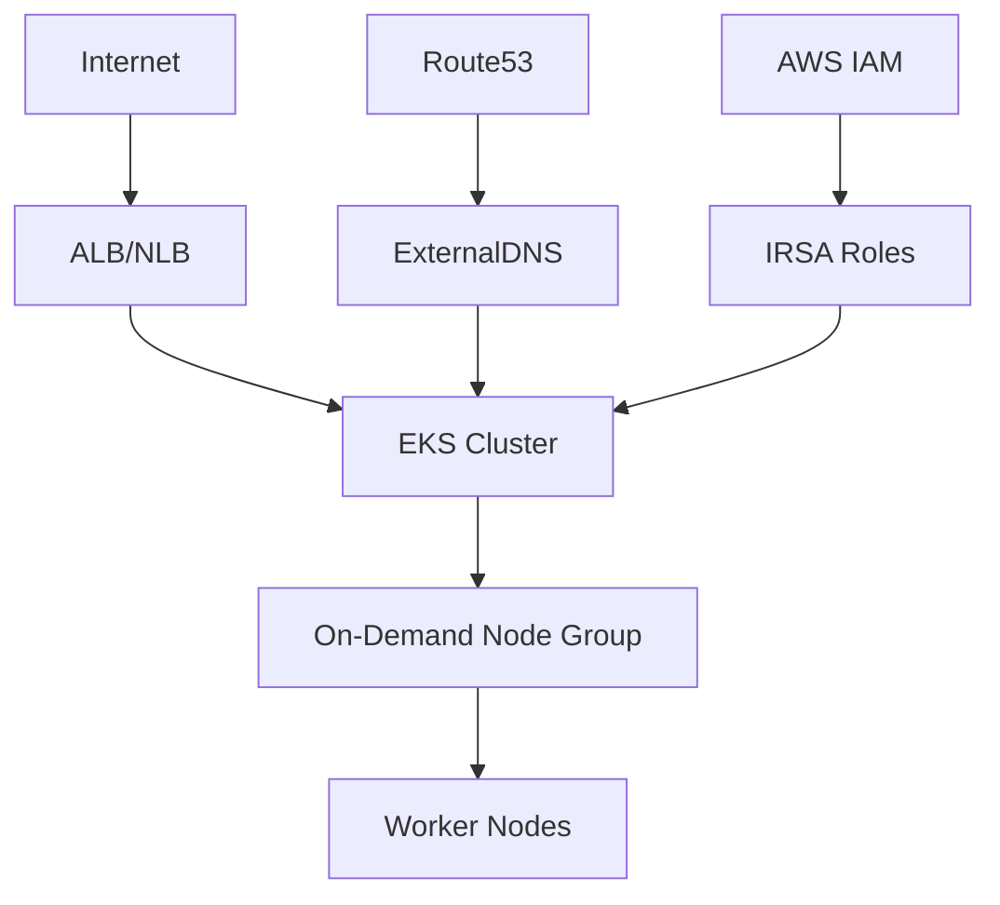

# EKS Cluster with On-Demand Instances

This example demonstrates deploying an EKS cluster with on-demand instances for production workloads that require guaranteed availability and performance.

## 🎯 What This Example Provides

- **EKS Cluster**: Production-ready Kubernetes cluster with on-demand instances
- **High Availability**: Guaranteed compute capacity without spot interruptions
- **AWS Load Balancer Controller**: Automatic ALB/NLB creation with IRSA integration
- **ExternalDNS**: Automatic DNS record management for ingresses and services
- **IRSA Integration**: IAM Roles for Service Accounts for secure AWS access
- **Route53 Integration**: Optional DNS automation with hosted zones
- **Production-Ready**: Optimized for workloads requiring consistent performance

## 🏗️ Architecture Overview



## 📋 Prerequisites

### Required Tools
- [Terraform](https://www.terraform.io/downloads.html) >= 1.0
- [AWS CLI](https://aws.amazon.com/cli/) configured with appropriate permissions
- [kubectl](https://kubernetes.io/docs/tasks/tools/) for cluster interaction

### AWS Permissions
Your AWS credentials need permissions for:
- EKS cluster management
- EC2 (VPC, subnets, security groups)
- IAM (roles, policies, OIDC provider)
- Route53 (if using DNS automation)

## 🚀 Quick Start

### 1. Configure Variables

Edit `terraform.tfvars` with your specific values:

```hcl
# Basic cluster configuration
cluster_name = "my-production-cluster"
cluster_version = "1.32"

# Network configuration
vpc_name = "my-vpc"  # or use vpc_id for explicit VPC
public_access_cidrs = ["YOUR.IP.ADDRESS/32"]  # Replace with your IP!

# Node group configuration - on-demand instances
node_group_instance_types = ["t3.medium", "m5.large"]
node_group_desired_size = 3
node_group_max_size = 6
node_group_min_size = 2

# DNS Configuration (optional)
create_hosted_zones = true
hosted_zone_domains = ["example.com"]

# Enable all components
enable_helm_deployments = true
enable_load_balancer_controller = true
enable_external_dns = true
```

### 2. Deploy Infrastructure

```bash
terraform init
terraform plan
terraform apply
```

### 3. Configure kubectl

```bash
# Get the kubeconfig command from Terraform output
terraform output kubeconfig_command

# Run the command (example):
aws eks update-kubeconfig --region us-west-2 --name my-production-cluster
```

### 4. Verify Installation

```bash
# Check cluster nodes
kubectl get nodes

# Check all components are running
kubectl get pods -n kube-system

# Verify Load Balancer Controller
kubectl get deployment -n kube-system aws-load-balancer-controller

# Verify ExternalDNS
kubectl get deployment -n kube-system external-dns
```

## 🔧 Configuration Options

### VPC Discovery Methods

Choose one of three methods to specify your VPC:

1. **By VPC Name** (recommended):
   ```hcl
   vpc_name = "my-vpc"
   ```

2. **By VPC Tags**:
   ```hcl
   vpc_tags = {
     Environment = "production"
     Team        = "platform"
   }
   ```

3. **By Explicit VPC ID**:
   ```hcl
   vpc_id = "vpc-12345678"
   ```

### Node Group Configuration

On-demand instances provide:
- **Guaranteed availability**: No interruptions like spot instances
- **Consistent performance**: Predictable compute resources
- **Production-ready**: Suitable for critical workloads

Configure instance types based on your workload requirements:

```hcl
# Cost-optimized for development
node_group_instance_types = ["t3.medium"]

# Balanced for general production workloads
node_group_instance_types = ["t3.medium", "m5.large"]

# Performance-optimized for CPU-intensive workloads
node_group_instance_types = ["c5.large", "c5.xlarge"]

# Memory-optimized for memory-intensive workloads
node_group_instance_types = ["r5.large", "r5.xlarge"]
```

### DNS Configuration

Enable DNS automation for seamless ingress management:

```hcl
# Create Route53 hosted zones
create_hosted_zones = true
hosted_zone_domains = ["example.com", "api.example.com"]

# Create subdomain zones for environment separation
create_subdomain_zones = true
subdomain_zones = ["dev", "staging", "prod"]
```

## 🛠️ Management Commands

### Scaling the Cluster

```bash
# Scale node group manually
aws eks update-nodegroup-config \
  --cluster-name my-production-cluster \
  --nodegroup-name production-nodes \
  --scaling-config minSize=3,maxSize=10,desiredSize=5
```

### Monitoring

```bash
# Check node utilization
kubectl top nodes

# Check pod resource usage
kubectl top pods --all-namespaces

# View cluster events
kubectl get events --sort-by='.lastTimestamp'
```

### Load Balancer Management

```bash
# List ALBs created by the controller
kubectl get ingress --all-namespaces

# Check Load Balancer Controller logs
kubectl logs -n kube-system -l app.kubernetes.io/name=aws-load-balancer-controller
```

### DNS Management

```bash
# Check ExternalDNS logs
kubectl logs -n kube-system -l app.kubernetes.io/name=external-dns

# List DNS records managed by ExternalDNS
kubectl get services --all-namespaces -o jsonpath='{range .items[*]}{.metadata.name}{"\t"}{.metadata.annotations.external-dns\.alpha\.kubernetes\.io/hostname}{"\n"}{end}'
```

## 📊 Cost Optimization

While on-demand instances cost more than spot instances, you can optimize costs:

### Instance Type Optimization

1. **Use diverse instance types** to allow flexibility in availability zones
2. **Right-size instances** based on actual resource usage
3. **Consider instance families** that match your workload patterns

### Cluster Optimization

```hcl
# Multi-AZ deployment for high availability
node_group_instance_types = [
  "t3.medium",   # General purpose
  "t3a.medium",  # AMD-based (often cheaper)
  "m5.large",    # Balanced compute/memory
  "m5a.large"    # AMD-based balanced
]

# Optimize for your workload
node_group_desired_size = 3  # Start smaller
node_group_max_size = 10     # Allow scaling up
node_group_min_size = 2      # Maintain minimum availability
```

## 🔍 Troubleshooting

### Common Issues

1. **Nodes not joining cluster**:
   ```bash
   # Check node group status
   aws eks describe-nodegroup --cluster-name my-cluster --nodegroup-name production-nodes
   
   # Check CloudFormation stack
   aws cloudformation describe-stacks --stack-name eksctl-my-cluster-nodegroup-production-nodes
   ```

2. **Load Balancer Controller issues**:
   ```bash
   # Check IRSA configuration
   kubectl describe sa aws-load-balancer-controller -n kube-system
   
   # Check controller logs
   kubectl logs -n kube-system -l app.kubernetes.io/name=aws-load-balancer-controller
   ```

3. **ExternalDNS not creating records**:
   ```bash
   # Check IRSA configuration
   kubectl describe sa external-dns -n kube-system
   
   # Check DNS logs
   kubectl logs -n kube-system -l app.kubernetes.io/name=external-dns
   
   # Verify Route53 permissions
   aws route53 list-hosted-zones
   ```

## 🧹 Cleanup

To destroy the infrastructure:

```bash
terraform destroy
```

**Note**: This will permanently delete your EKS cluster and all associated resources.

## 📚 Additional Resources

- [Amazon EKS User Guide](https://docs.aws.amazon.com/eks/latest/userguide/)
- [AWS Load Balancer Controller](https://kubernetes-sigs.github.io/aws-load-balancer-controller/)
- [ExternalDNS Documentation](https://github.com/kubernetes-sigs/external-dns)
- [EKS Best Practices Guide](https://aws.github.io/aws-eks-best-practices/)
- [EC2 Instance Types](https://aws.amazon.com/ec2/instance-types/)

## 🤝 Contributing

1. Fork the repository
2. Create a feature branch
3. Make your changes
4. Test thoroughly
5. Submit a pull request