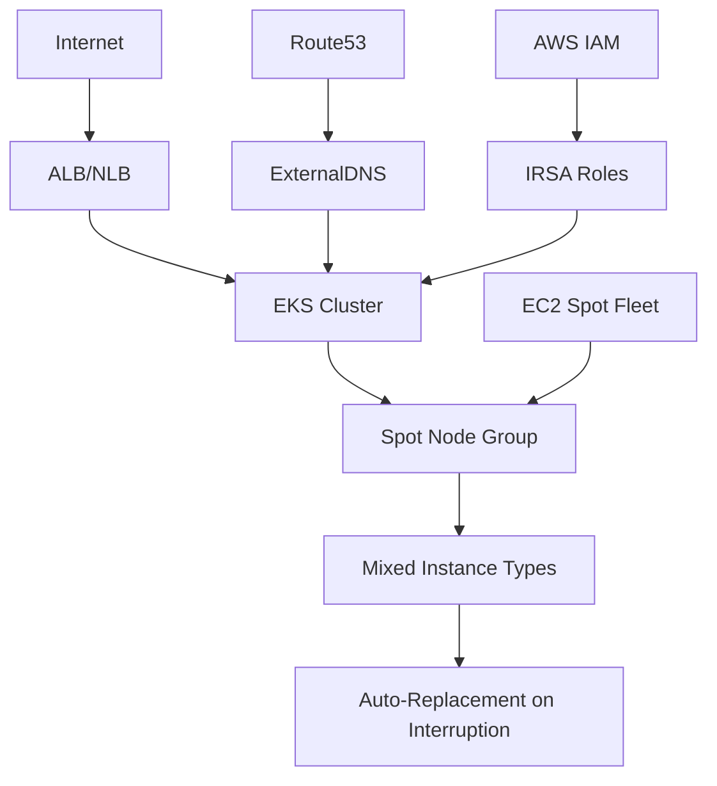

# EKS Cluster with Spot Instances

This example demonstrates deploying a cost-optimized EKS cluster using EC2 Spot instances, providing up to 90% cost savings compared to on-demand instances.

## 🎯 What This Example Provides

- **Cost Optimization**: Up to 90% savings using EC2 Spot instances
- **High Availability**: Multiple instance types for better spot availability
- **AWS Load Balancer Controller**: Automatic ALB/NLB creation with IRSA integration
- **ExternalDNS**: Automatic DNS record management for ingresses and services
- **IRSA Integration**: IAM Roles for Service Accounts for secure AWS access
- **Route53 Integration**: Optional DNS automation with hosted zones
- **Development-Ready**: Optimized for non-critical workloads and development environments

## 🏗️ Architecture Overview



## 📋 Prerequisites

### Required Tools
- [Terraform](https://www.terraform.io/downloads.html) >= 1.0
- [AWS CLI](https://aws.amazon.com/cli/) configured with appropriate permissions
- [kubectl](https://kubernetes.io/docs/tasks/tools/) for cluster interaction

### AWS Permissions
Your AWS credentials need permissions for:
- EKS cluster management
- EC2 (VPC, subnets, security groups, spot instances)
- IAM (roles, policies, OIDC provider)
- Route53 (if using DNS automation)

## 🚀 Quick Start

### 1. Configure Variables

Edit `terraform.tfvars` with your specific values:

```hcl
# Basic cluster configuration
cluster_name = "my-spot-cluster"
cluster_version = "1.32"

# Network configuration
vpc_name = "my-vpc"  # or use vpc_id for explicit VPC
public_access_cidrs = ["YOUR.IP.ADDRESS/32"]  # Replace with your IP!

# Node group configuration - spot instances with multiple types
node_group_instance_types = ["t3.medium", "t3a.medium", "m5.large", "m5a.large"]
node_group_desired_size = 3  # Higher count for interruption tolerance
node_group_max_size = 6      # Allow scaling during interruptions
node_group_min_size = 1      # Minimum for cost optimization

# DNS Configuration (optional)
create_hosted_zones = true
hosted_zone_domains = ["example.com"]

# Enable all components
enable_helm_deployments = true
enable_load_balancer_controller = true
enable_external_dns = true
```

### 2. Deploy Infrastructure

```bash
terraform init
terraform plan
terraform apply
```

### 3. Configure kubectl

```bash
# Get the kubeconfig command from Terraform output
terraform output kubeconfig_command

# Run the command (example):
aws eks update-kubeconfig --region us-west-2 --name my-spot-cluster
```

### 4. Verify Installation

```bash
# Check cluster nodes
kubectl get nodes

# Check node capacity type (should show SPOT)
kubectl get nodes -o custom-columns=NAME:.metadata.name,CAPACITY-TYPE:.metadata.labels."karpenter\.sh/capacity-type"

# Check all components are running
kubectl get pods -n kube-system

# Verify Load Balancer Controller
kubectl get deployment -n kube-system aws-load-balancer-controller

# Verify ExternalDNS
kubectl get deployment -n kube-system external-dns
```

## 💰 Cost Optimization Benefits

### Spot Instance Advantages

1. **Significant Cost Savings**: Up to 90% less than on-demand instances
2. **Automatic Scaling**: EKS automatically replaces interrupted instances
3. **Multiple Instance Types**: Increases availability and reduces interruption risk
4. **Ideal for Development**: Perfect for non-production workloads

### Cost Comparison

| Instance Type | On-Demand ($/hour) | Spot ($/hour) | Savings |
|---------------|-------------------|---------------|---------|
| t3.medium     | $0.0416          | ~$0.0125      | ~70%    |
| m5.large      | $0.096           | ~$0.0288      | ~70%    |
| c5.large      | $0.085           | ~$0.0255      | ~70%    |

*Prices vary by region and availability*

## 🔧 Configuration Best Practices

### Instance Type Selection

Use diverse instance types for better spot availability:

```hcl
# Recommended: Mix of different families and generations
node_group_instance_types = [
  "t3.medium",   # General purpose
  "t3a.medium",  # AMD-based (often more available)
  "m5.large",    # Balanced compute/memory
  "m5a.large",   # AMD-based balanced
  "c5.large",    # Compute optimized (if needed)
]

# For CPU-intensive workloads
node_group_instance_types = [
  "c5.large", "c5.xlarge",
  "c5a.large", "c5a.xlarge",
  "c5n.large", "c5n.xlarge"
]

# For memory-intensive workloads
node_group_instance_types = [
  "r5.large", "r5.xlarge",
  "r5a.large", "r5a.xlarge",
  "r5n.large", "r5n.xlarge"
]
```

### Sizing Strategy

```hcl
# Development environment
node_group_desired_size = 2
node_group_max_size = 4
node_group_min_size = 1

# Testing environment with higher availability needs
node_group_desired_size = 3
node_group_max_size = 6
node_group_min_size = 2

# Load testing environment
node_group_desired_size = 5
node_group_max_size = 10
node_group_min_size = 2
```

## 🛡️ Handling Spot Interruptions

### Kubernetes Best Practices

1. **Pod Disruption Budgets**:
   ```yaml
   apiVersion: policy/v1
   kind: PodDisruptionBudget
   metadata:
     name: app-pdb
   spec:
     minAvailable: 2
     selector:
       matchLabels:
         app: my-app
   ```

2. **Multiple Replicas**:
   ```yaml
   apiVersion: apps/v1
   kind: Deployment
   metadata:
     name: my-app
   spec:
     replicas: 3  # Always run multiple replicas
     template:
       spec:
         tolerations:
         - key: "node.kubernetes.io/instance-type"
           operator: "Equal"
           value: "spot"
           effect: "NoSchedule"
   ```

3. **Graceful Shutdowns**:
   ```yaml
   spec:
     template:
       spec:
         terminationGracePeriodSeconds: 120
         containers:
         - name: app
           lifecycle:
             preStop:
               exec:
                 command: ["/bin/sh", "-c", "sleep 15"]
   ```

### Monitoring Spot Interruptions

```bash
# Check for spot interruption warnings
kubectl get events --field-selector reason=SpotInterruption

# Monitor node replacement
kubectl get nodes -w

# Check cluster autoscaler logs
kubectl logs -n kube-system -l app=cluster-autoscaler
```

## 🔍 Monitoring and Management

### Cost Monitoring

```bash
# Check spot instance savings
aws ec2 describe-spot-price-history \
  --instance-types t3.medium m5.large \
  --product-descriptions "Linux/UNIX" \
  --max-items 10

# Get current spot prices
aws ec2 describe-spot-price-history \
  --instance-types t3.medium \
  --product-descriptions "Linux/UNIX" \
  --start-time $(date -u -d '1 hour ago' +%Y-%m-%dT%H:%M:%S) \
  --end-time $(date -u +%Y-%m-%dT%H:%M:%S)
```

### Node Management

```bash
# Check node capacity types
kubectl get nodes -o custom-columns=NAME:.metadata.name,INSTANCE-TYPE:.metadata.labels."node\.kubernetes\.io/instance-type",CAPACITY-TYPE:.spec.taints[0].value

# Monitor node health
kubectl describe nodes | grep -E "(Name:|Capacity:|Conditions:)"

# Check node utilization
kubectl top nodes
```

### Workload Distribution

```bash
# Check pod distribution across nodes
kubectl get pods -o wide --all-namespaces | awk '{print $8}' | sort | uniq -c

# Monitor pod evictions
kubectl get events --field-selector reason=Evicted
```

## ⚠️ Important Considerations

### When to Use Spot Instances

✅ **Good for**:
- Development and testing environments
- Batch processing jobs
- Stateless applications
- CI/CD workloads
- Machine learning training
- Data processing pipelines

❌ **Not recommended for**:
- Production databases
- Real-time applications with strict SLAs
- Single-instance critical services
- Applications that can't handle interruptions

### Workload Recommendations

1. **Make applications fault-tolerant**
2. **Use horizontal scaling** (multiple replicas)
3. **Implement graceful shutdowns**
4. **Use persistent storage** for stateful data
5. **Monitor and alert** on interruptions

## 🔍 Troubleshooting

### Common Issues

1. **Frequent interruptions**:
   ```bash
   # Add more instance types to your configuration
   node_group_instance_types = [
     "t3.medium", "t3.large", "t3.xlarge",
     "t3a.medium", "t3a.large", "t3a.xlarge",
     "m5.large", "m5.xlarge",
     "m5a.large", "m5a.xlarge"
   ]
   ```

2. **No spot capacity**:
   ```bash
   # Check spot availability in different AZs
   aws ec2 describe-spot-price-history \
     --instance-types t3.medium \
     --availability-zone us-west-2a \
     --product-descriptions "Linux/UNIX"
   ```

3. **Applications not handling interruptions**:
   - Implement proper pod disruption budgets
   - Use readiness/liveness probes
   - Configure graceful shutdown periods

### Monitoring Commands

```bash
# Check cluster events for spot-related issues
kubectl get events --sort-by='.lastTimestamp' | grep -i spot

# Monitor Auto Scaling Group
aws autoscaling describe-auto-scaling-groups \
  --auto-scaling-group-names $(terraform output -raw node_group_asg_name)

# Check EC2 spot fleet requests
aws ec2 describe-spot-fleet-requests
```

## 🧹 Cleanup

To destroy the infrastructure:

```bash
terraform destroy
```

**Note**: This will permanently delete your EKS cluster and all associated resources.

## 📚 Additional Resources

- [Amazon EC2 Spot Instances](https://aws.amazon.com/ec2/spot/)
- [EKS Managed Node Groups with Spot](https://docs.aws.amazon.com/eks/latest/userguide/managed-node-groups.html)
- [Spot Instance Best Practices](https://docs.aws.amazon.com/AWSEC2/latest/UserGuide/spot-best-practices.html)
- [Kubernetes Pod Disruption Budgets](https://kubernetes.io/docs/tasks/run-application/configure-pdb/)
- [AWS Spot Instance Advisor](https://aws.amazon.com/ec2/spot/instance-advisor/)

## 🤝 Contributing

1. Fork the repository
2. Create a feature branch
3. Make your changes
4. Test thoroughly with spot interruption scenarios
5. Submit a pull request